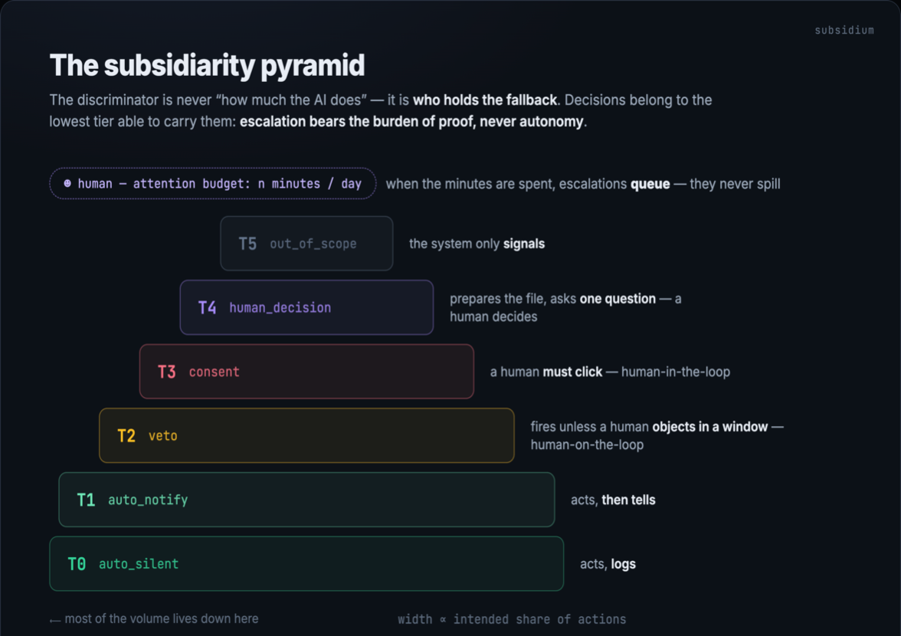
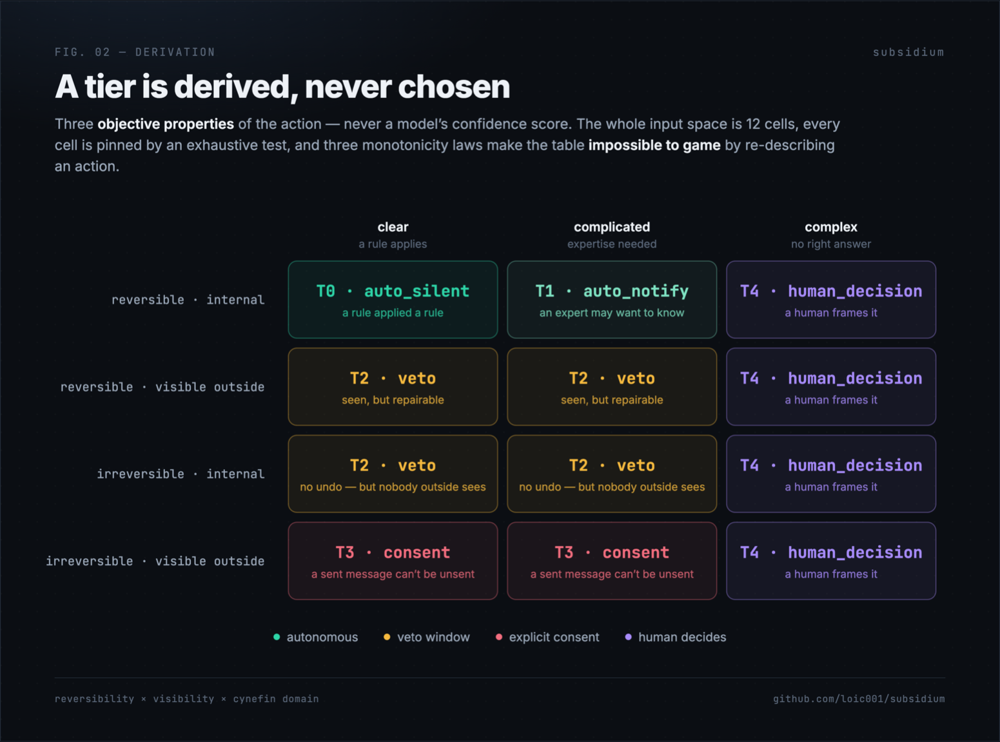
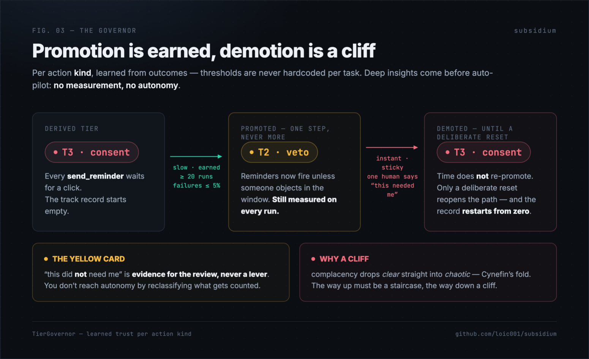
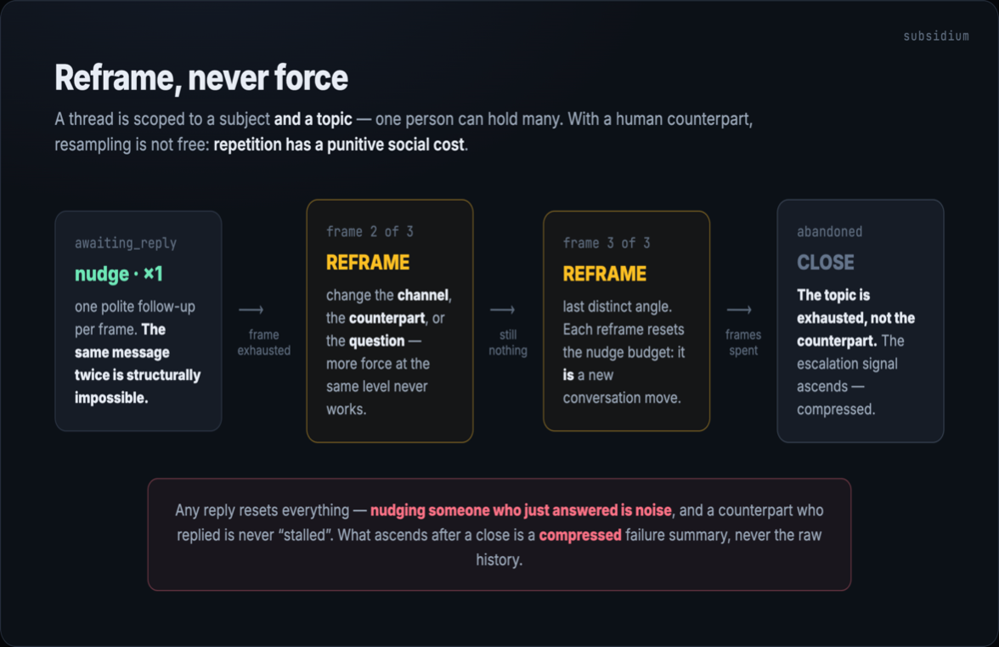

# subsidium

[](https://github.com/loic001/subsidium/actions/workflows/ci.yml)

### Humans are the most expensive tier.

Subsidium is an operational-assistance framework for driving an **existing**
system: agents operate it, communicate flawlessly with the humans around it,
and escalate to a person only what has **proven** it needs one.

It is **not a coding agent**. It does not write code, fix codebases, or ship
features. If the output of a task is a diff, it is out of scope. The output
of a subsidium system is an operated business: messages sent, blockers
cleared, cases moved forward, and a short, honest queue for the humans.

The name is the Latin *subsidium* — the reserve line, the reinforcement.
Under the principle of subsidiarity (Aquinas → Taparelli 1840 → art. 5(3)
of the EU treaty), decisions belong to the lowest level capable of handling
them, and **escalation bears the burden of proof — never autonomy**.

Sibling project: [panarchy-llm](https://github.com/loic001/panarchy-llm),
which measured the same architecture with model tiers instead of human
tiers. Subsidium adds the one thing an LLM cascade does not model: a tier
whose budget is a person's **attention**, and whose sampling has a
**social cost**.

## Install

```bash
npm install subsidium
```

The kernel has **zero runtime dependencies**. The dashboard bricks
(`subsidium/ui`) need `react >= 18` as an optional peer.

## Your agent is the worker. This is the door.

Subsidium is **not another agent framework** — it is the layer the agent
frameworks are missing. Hermes, OpenClaw, Mastra, a cron script, an intern:
all of them are *workers*. None of them answers the questions that decide
whether you can trust one with your company:

- **What may run on its own, and who says so?** Not a config flag, not the
  model's confidence — a tier *derived* from reversibility, external
  visibility, and problem domain. Same inputs, same tier, on any machine.
- **How does autonomy grow?** It is earned per action kind: 20 clean runs
  under an error budget buy exactly one tier of promotion. One human
  contest — "this needed me" — snaps it back instantly, and it sticks.
- **What does the human cost?** Minutes, budgeted. When the founder's 60
  minutes are spent, escalations queue; they never spill into an inbox
  nobody reads.

The performance claim is measured, not vibed (full table below,
`npm run sim`, seeded and pinned by tests): the pyramid + governor policy
unblocks **4.08 subjects per human-hour vs 1.5 for send-everything-to-
approval**, at 6 incidents vs 88 for full autonomy. That is the honest
pitch: *more throughput than asking permission for everything, ~14× fewer
incidents than trusting the agent with everything.*

Wiring it around any agent is ~30 lines
([`examples/gate-an-agent.ts`](examples/gate-an-agent.ts), runnable with
`npx tsx`; the same door around **real Mastra tools + agent** is
[`examples/mastra-gate.ts`](examples/mastra-gate.ts) — the gate *is* the
tool's `execute`, and the agent never knows it is being governed):

```ts
import { deriveTier, tierInput, TierGovernor, TIER_MODE, admit } from 'subsidium'

const governor = new TierGovernor() // persist with dump()/hydrate()

async function agentWantsTo(action: ActionSpec<Ctx>, ctx: Ctx) {
  const derived = deriveTier(tierInput(action, action.channel))
  const tier = governor.effectiveTier(action.kind, derived.tier)
  switch (TIER_MODE[tier]) {
    case 'auto_silent':
    case 'auto_notify': {
      if (!(await action.verify(ctx)).ok) return // the oracle, not vibes
      const run = await action.execute(ctx)
      return governor.record(action.kind, run.ok ? 'success' : 'failure')
    }
    case 'veto':
      return openVetoWindow(action, ctx) // fires unless a human objects
    default:
      return queueForHuman(action, ctx, derived.reasons) // attention-budgeted
  }
}
```

The agent proposes; the door decides; the ledger remembers. Swap the agent
for a better one next year — the governance, the track record, and the
inbox UI (`subsidium/ui`) stay.

## The pyramid

The discriminator between tiers is never "how much the AI does". It is
**who holds the fallback** (the lesson of SAE J3016, and of the
human-in/on/out-of-the-loop vocabulary).



A tier is **derived, never chosen**, from three objective properties —
never from a model's confidence score, which is neither calibrated nor the
right axis: **reversibility** (a sent message cannot be unsent),
**external visibility** (does anyone outside the organization see it?),
and the **Cynefin domain** (clear / complicated / complex).



Every tier above 0 carries human-readable reasons, enforced structurally.
An unexplained escalation is the exact failure mode this framework exists
to prevent.

## The laws (each one paid for)

**Our own voice is not engagement.** Systems that ingest their own messages
count themselves as replies. Measured on the production system this
framework was extracted from: 81% apparent reply rate, 11% real. Every
engagement counter must pass an authorship predicate, fail-closed:
"I don't know who spoke" never counts as "the counterpart replied".

**Promotion is earned, demotion is a cliff.** An action kind runs one tier
below its derived tier only after a measured track record under an error
budget (the Kubernetes operator lesson: Deep Insights before Auto Pilot).
One human contest — "this needed me" — snaps it back instantly and
stickily. The yellow card — "this did *not* need me" — is evidence for the
review, never a lever: you do not reach autonomy by reclassifying what
gets counted.



**Reframe, never force.** With a human counterpart, resampling is not free:
repetition has a punitive social cost. A stalled thread is never re-nudged
identically — the next move must change the channel, the counterpart, or
the question, or close the thread (Bateson; measured in panarchy-llm as
decomposition 98% vs escalation 90%).



**Errors ascend compressed.** The tier above needs to know what failed and
what was tried — never the raw history (Beer's algedonic signal, Friston's
prediction errors). Handing a human the full dump spends their attention
on reading instead of deciding.

**Attention is a budget, not a firehose.** When the human tier's daily
minutes are spent, escalations queue; they do not spill. An overflowing
inbox teaches its owner to ignore all of it.

## SOP & measure — optimizing the company without lying to yourself

"Optimize the company" decomposes into **procedures** and the **numbers**
that judge them. Both are primitives here, because both are where the
lying happens:

**A SOP is a first-class citizen** ([`src/sop.ts`](src/sop.ts)) — a named,
versioned chain of actions with three laws:

- **Weakest link**: `deriveSopTier` gives the chain the tier of its most
  dangerous step — never an average, never a separate declaration. A
  procedure with one merchant-visible irreversible step *is* T3, whatever
  its name says, and the verdict names the step that forced it.
- **Approval follows verification**: `sopTransition` is a one-way ladder
  (draft → verified → approved) and any *edit* falls back to draft — a
  human approved a text they read; if the text changed, that approval is
  void. Only `approved` is runnable (`sopRunnable`).
- **Trust belongs to the version**: `sopGovernorKey` keys the earned
  autonomy on `(id, version)`. Edit the procedure → new version → the
  track record restarts at zero. Otherwise a trusted name inherits trust
  its new body never earned — the same door Goodhart uses.

**A measurement carries its own honesty** ([`src/measure.ts`](src/measure.ts)) —
every `reading` pins the **verbatim definition** and the **sample size**;
`judge(spec, treated, baseline)` is the only way to claim success, and it
answers `not_comparable` the moment the definition differs between
readings (any improvement obtained by changing what is counted is a
regression), `too_early` below the n bar, and `improved` / `regressed` /
`no_effect` only past both. It is deliberately *not* a significance test —
no p-value theater, just the three questions that catch most lies:
compared to what? on how many? counted how?

## Vocabulary

| Concept | One line |
|---|---|
| `Subject` | the entity being helped through a process (a merchant, an applicant) — *not* called "agent" |
| `Counterpart` | a human the system talks to, with a side: `us` or `them` |
| `ChannelSpec` | a transport described by reversibility, external visibility, observability |
| `ActionSpec` | `describe` / `verify` / `execute` — `verify` is the oracle, and an action without a real one is a turkey |
| `Thread` | a conversation scoped to a subject **and a topic** — one person can hold n threads |
| `TierVerdict` | derived tier + mode + the reasons that forced it up |
| `TierGovernor` | learned trust per action kind: slow earned promotion, instant sticky demotion |
| `EscalationSignal` | the compressed failure that ascends |
| `AttentionBudget` | minutes per day, minutes per item — the human tier's ledger |
| `SopSpec` | a versioned chain of actions: weakest-link tier, approval voided by edits, trust per version |
| `MetricSpec` / `judge` | a definition-pinned metric and the only honest way to claim it moved |

## Tested like it decides someone's day — because it does

Every primitive here decides whether a human gets disturbed, so the test
bar is the sibling repo's, not the industry's:

- **100% coverage on `src/` — statements, branches, functions, lines —
  enforced in CI** (`vitest.config.ts` thresholds: the build fails below).
  The only tolerated gap is an explicit `v8 ignore` block carrying its
  justification inline (there is exactly one: a structurally unreachable
  tripwire, proven unreachable by the exhaustive table test).
- **The classifier is tested over its ENTIRE input space** (2×2×3 = 12
  cells — no excuse for sampling), plus three monotonicity laws: losing
  reversibility, gaining visibility, or hardening the domain can never
  LOWER a tier. Without monotonicity the pyramid can be gamed by
  re-describing an action.
- **The governor is fuzzed** with seeded random event sequences (n=500)
  against its core invariant: the effective tier is always the derived
  tier or exactly one below, never lower.
- **Pathological configs explode instead of degrading silently**: an
  attention budget that can never admit a single item throws at first use
  — a silent infinite queue wearing the costume of a tight budget is a
  turkey.

Run it: `npm install && npm run typecheck && npm run coverage`.

The figures above are not hand-drawn: their HTML source lives in
[`art/diagrams.html`](art/diagrams.html) — edit, reload, re-shoot.

## The closed world — `npm run sim`

Before the framework is allowed to spend a minute of a human's attention or
a counterpart's patience, its laws run inside a **seeded, deterministic,
free** simulation ([`src/sim.ts`](src/sim.ts)) that drives the REAL
primitives — `deriveTier`, `TierGovernor`, the thread state machine —
against rival policies in a world with known ground truth. Every ordering
below is pinned by a test; same seeds, same numbers, on any machine.

60 days · 20 proposals/day · 60 human-minutes/day · 5 seeds:

| policy | unblocked | incidents | human minutes | queue at end | unblocked/hour |
|---|---|---|---|---|---|
| `all_auto` (the 2023 agent) | **163.8** | **88** | 0 | 0 | ∞ |
| `all_consent` (everything waits) | 90.2 | 5 | 3600 | **480** | 1.5 |
| `pyramid` | 147.6 | 6.2 | 2336 | 4 | 3.79 |
| `pyramid + governor` | 152.4 | 6.0 | 2241 | 4 | **4.08** |

The pyramid unblocks **+64% more subjects than all-consent, with fewer
human minutes, at nearly the same safety** — and all-auto's throughput
crown costs 14× the incidents.

Under drift (a promoted kind turns rotten at day 30), the cliff halves the
damage vs promotion-without-demotion (34.2 vs 65.4 bad fires) — and, a
result that surprised us and is pinned as such in the tests: it lands *at
or below* the never-promoting static pyramid, because vetoes and
rejections feed the failure record too.

Outreach, 500 counterparts with a hidden preferred channel and a patience
threshold: the thread law gets **3× the replies of the naive hammer with
half the messages and structurally zero social damage** (298 replies /
1186 messages / 0 annoyed, vs 105 / 2475 / 1975).

What the closed world proves: the orderings, under stated assumptions.
What it cannot prove: the assumptions. Production keeps the final word —
a simulation win is a license to run the real experiment, never a
substitute for it.

## The dashboard — `subsidium/ui`

The kernel is the intermediary. You declare the host system (channels,
actions, subjects, a queue). The visual layer is built from that — you
do not redraw Approvals / the pyramid / an escalation briefing for every
business. Drop the bricks in your own app:

```ts
import 'subsidium/ui/styles.css'
import { EscalationBriefView, TierBands, TierChip, TierPyramid } from 'subsidium/ui'
import { deriveTier, whyEscalated, bandByTier, countByTier } from 'subsidium'
```

- **`TierPyramid`** — the six tiers, always visible (T5 on top, T0 at the
  bottom). Empty rungs stay so the shape does not collapse. Pass `onSelect`
  and the rungs become the filter (click again to clear).
- **`TierBands`** — the inbox, grouped from T0 (autonomous) to T5 (human).
  Empty bands are omitted.
- **`TierChip`** — the T0–T5 pastille on a card.
- **`EscalationBriefView`** — the read-only page a teammate opens from a
  capability-token URL: the problem, why it rose the pyramid, the timeline.
- **`whyEscalated` / `bandByTier` / `countByTier` / `tierMeta`** live in
  the kernel (pure, 100% tested). React is a peer dependency of `./ui` only.

## Status — read before using

Extracted from a production system operating a payments company's merchant
activation (hundreds of subjects, a real team, a real founder as the top
tier). The core primitives here are pure, deterministic, and tested. The
architecture's *outcome* claims (does the pyramid beat all-goes-to-approval
on cases-unblocked-per-attention-hour?) are **being measured, not yet
proven** — the sibling repo's standard applies: a number without an n and a
reproducible script is a vibe.

## License

MIT
